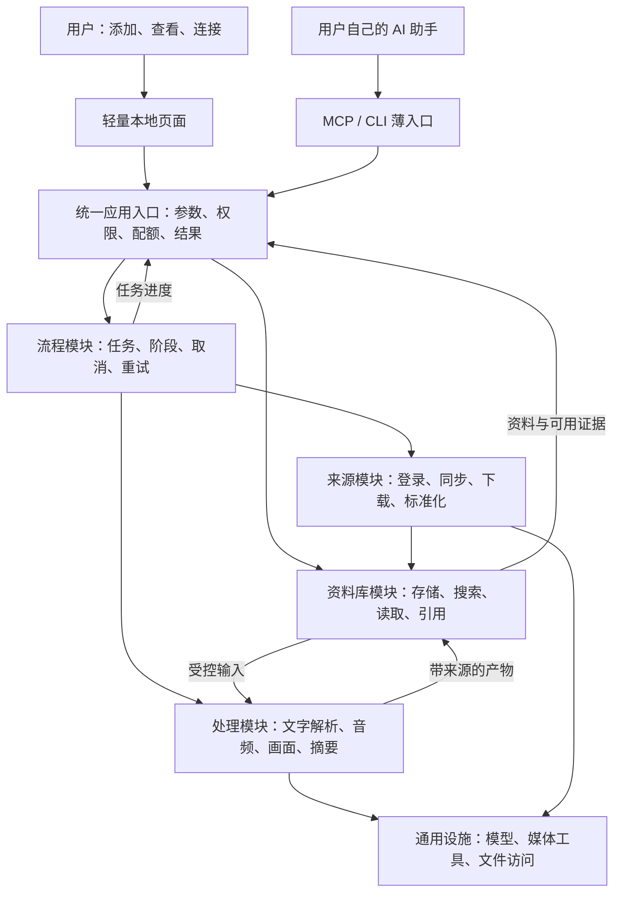

# 收藏上下文产品：整体架构重评

日期：2026-10-01。状态：**首发使用规则已确认；工程规划须由用户再次审阅并批准后才可实施。当前仅文档规划，不是已完成的重构，不授权修改现有生产服务或公开私人资料。**

实施评审入口：[开发规划与分阶段验收](2026-10-01-抖音上下文MVP-开发规划与分阶段验收.md)。本文件保留架构理由与现状检查；具体任务、先后依赖和验收以总计划为准，代码事实以实际验收记录为准。

依据：用户最新提出的“自有项目、统一后端、精简准确、小白可接入”；[ADR-005](decisions/ADR-005-收藏上下文能力层与Agent优先首发.md)；本次代码检查与[已有首轮验收](2026-10-01-收藏上下文能力-首轮验收.md)。本次没有变更资料、登录态、模型路由、后台服务或第三方项目。

### 本轮澄清后已确认的边界

- MVP 仅做抖音；公众号、小红书及通用文件解析不作为首版对外功能承诺。内部现有能力保留。
- 首发来源包含本人喜欢、收藏、指定收藏夹、指定博主的已发布作品同步/批量下载，以及单条链接；视频与图文都纳入，单账号起步。指定博主不自动扩展为所有关注账号，也不读取其非公开喜欢或收藏。
- 公开首版必须支持 macOS、Windows、Linux，包含无桌面的 Linux 服务器；后台可独立供用户的 AI 调用，不依赖桌面外壳或 Mac。最低系统版本、CPU 架构、Linux 发行版须在实际支持矩阵中明确。
- 用户配置自己的模型接口并承担相应调用费用；项目不提供云端推理、中转、统一模型账户或充值服务。
- 默认保持常规音频/关键帧/总结链路；图像模型能否兼任音频和文字角色须检测，不能仅凭“支持看图”认定全链路可用。
- 音频优先调用用户自配 API Key 的云端音频模型；本地语音识别不是首版强制依赖。未配置音频能力时可先保存资料，明确显示口播未提取，不用字幕或摘要冒充完整转写。
- 新增内容提取提供自动开关与手动启动，历史内容分批处理；首次小批试跑、用量上限、重复提取保护共用。开关是新产品行为，不改变当前私人账号的自动化设置。
- 轻量管理页面随首发交付；原视频默认不自动删除，文字/来源/关键帧长期保留。AI 默认只读，添加链接可单独授权，批量/删除/重新计费提取需明确授权。
- 用户已确认上述使用规则，并要求先写完整开发规划、汇报后再次确认才开发；当前不做代码、依赖安装或技术试验。新的产品范围分歧仍需提问，技术参数在获准开发后通过样例验证确定。

上述产品边界已确认，[开发规范 v1](../../CONTRIBUTING.md)及总计划等待本次开工评审。跨平台 OCR 质量、无桌面服务器的来源登录、各类来源分页、具体系统版本与 AI 客户端兼容性属于批准后的技术验收项。接口角色拆分、安全访问和用量记录不冒充已实现。

## 1. 先定产品，再定架构

一句话：**让你的 AI 用得上你收藏过的东西。**

真正交付的结果：用户说“我想做一个天气 App，之前收藏过相关教程”，自己的 AI 能找到那条收藏，读到视频画面里的提示词，给出有出处的做法，并说明哪些内容没有提取出来。

核心衡量指标是“过去保存的资料，在当前任务里被找回并正确使用”。收藏数量、生成摘要数量、支持工具数量只作辅助指标。

### 用户与首发边界

- 首发核心用户：已经日常使用 AI，但不懂终端、MCP、模型配置和资料库目录的人。优先服务愿意在电脑上安装一个小工具的人。
- 只用网页聊天、没有本地工具接入能力的人：提供资料查看和导出给 AI；不能宣传安装后网页 AI 就自动读到了电脑文件。
- 开发者：同一产品提供 CLI、MCP 和模块调用，不要求他们使用管理页面。
- 暂缓：自建聊天机器人、自动个人画像、财务整合、发布系统、多用户云平台、插件市场、知识图谱。
- 内部选题、写作、视觉与发布流程继续保留，作为本产品的使用方；不进入新用户的默认安装包。

面向小白正式发布时，**轻量管理界面是标准交付的一部分**，负责安装、连接、确认、排障和查看资料；用户已接受此规则。后台可独立运行，不需要发展成复杂创作工作台；仍未批准删除旧控制台或重做完整知识库前端。

## 2. 现有项目重新评估

以下为代码检查发现；165 项通过和性能数字引用当日已有验收记录，本次没有重新执行测试或付费调用。

| 现有部分 | 证据与问题 | 判断 |
| --- | --- | --- |
| 只读能力 | `collection_context_service.py` 已统一搜索、分段读取、来源和权限边界；MCP 共用服务 | 保留，是可复用内核；不是完整产品 |
| 搜索 | 按空格分词，并要求同条资料包含全部词；尚无语义召回。388 条资料首次扫描约 18 秒，同进程再次约 0.4 秒 | 需要中文召回与索引生命周期改进，不能要求小白学会写关键词 |
| 资料引用 | 当前 `m1:` 引用编码素材相对路径 | 路径改名会改变引用，需要独立于路径的长期 ID 与旧引用映射 |
| 处理状态 | 已有 `media_manifest.json`，但完成判断仍大量依赖文件存在和正文中的失败标记 | 保留旧数据兼容；新处理结果改成结构化状态，不能只改页面文案 |
| 媒体处理 | `media_extraction_service.py` 约 1,346 行，包含选帧、模型调用、产物写入、素材卡更新、重试判断 | 按处理阶段拆开；保留已有效的提取方法和测试 |
| 平台接入 | 抖音依赖 dYm 的登录存储及 Electron/PolyDL 路径；小红书有 All-IN-ONE 路径依赖；公众号连接 we-mp-rss | 属于本机可用链路，独立新机器安装和自有连接器仍需完成 |
| 同步范围 | 抖音集合适配中存在合成 `browser-collection`，列表返回 `has_more=False` 的路径 | 重新验收指定收藏夹、分页和数量；不能把“返回最近 N 条”展示成“全部收藏同步完毕” |
| 任务管理 | 控制台、定时脚本各有锁；通用运行日志没有统一的可恢复阶段状态 | 需要单一任务所有者、统一状态与检查点；不能仅用“加一个进度条”解决 |
| 运行配置 | 同时有环境变量、项目相对路径、平台应用目录、Keychain 和模型专用配置 | 生产现状保留；新产品改为一个配置入口与凭据引用 |
| 用户页面 | 当前总览、能力、运行记录、健康等是内部运维视角 | 新用户优先看到“我的收藏 / 添加与连接 / 需要我处理”，隐藏内部术语 |
| 发行包 | 当前 Python 包匹配 `app*`，包含原内容生产能力；个人库和第三方工作副本仍在工作目录 | 建立明确发行白名单；不整体公开当前仓库 |

结论：主要缺口在**职责边界、数据契约、可恢复运行、接入体验和真实验收**。单纯换目录名、加一层 MCP、把多个外部项目装在一起，都不足以完成产品化。

## 3. 用户实际怎么用

### 第一次使用

1. **下载并打开**：桌面用户获得 macOS、Windows、Linux 的已验收安装方式，携带或引导安装必要运行环境，不要求手工配 Python/Node/Docker；无桌面 Linux 提供独立后端的部署包与启动说明，可选容器封装，不能强制安装桌面程序。三端及无桌面运行属于正式发布门槛，具体版本与架构写入支持矩阵。
2. **选择保存位置**：提供默认目录，允许外置盘；先用原创样例立即演示搜索和阅读。已有非空目录只能选择“连接已有库”，不能初始化覆盖。
3. **添加第一份内容**：粘贴一条抖音链接，或选择已连接账号的同步范围。通用文件/文字导入仅用于开发样例，不是首版公开功能；遇到平台登录时打开明确的登录引导，不要求复制 Cookie，不自动借用其他应用的登录库。
4. **确认处理方式**：普通文字可以先保存和查询；视频识别需要的云模型连接、发送内容、用量限制明确展示。没有配置模型时仍可保存，显示“视频待识别”。
5. **连接我的 AI**：选择经过验收的 AI 客户端，预览读库权限，确认后生成或安装对应配置，再做一次真实调用检测。页面最终显示“已连接，试着问：……”；只有配置文件写入成功不算连接完成。

先让用户在样例上看见价值，再要求登录和模型配置。模型供应商预设可以简化设置，不能把“免配置”写成无条件免费。新用户无需安装或部署开发者使用的 New API；它只是可选的自定义网关。

### 三个页面足够起步

| 页面 | 小白看到的操作与信息 |
| --- | --- |
| 我的收藏 | 搜索、列表、打开来源；原文/转写/画面文字/总结分开看；资料可排除或导出 |
| 添加与连接 | 粘贴抖音链接、平台登录、同步范围、连接 AI；模型设置藏在需要时出现的引导里 |
| 处理与设置 | 哪条正在处理、哪条缺内容、重新登录/重试按钮、空间与用量、备份与诊断 |

状态用“原文已保存；声音已转写；画面文字尚未识别”表达，避免一个不透明的“完成”。失败展示原因、已保存内容和下一步；不把调用堆栈、Cookie、完整平台返回给用户。

首发体验示例：粘贴一条教程 → 查看已保存的内容 → 连接 AI → 让 AI 从收藏里找做法 → 打开引用核对。自动同步在这个闭环稳定后再开启，首批仅处理少量新增资料。

### 已确认的来源范围与处理开关

| 入口 | 首版范围 | 不能据此推断 |
| --- | --- | --- |
| 本人喜欢 | 用户已登录账号有权读取的喜欢列表，按授权范围分页/增量 | 每条都代表长期偏好；作品发布时间就是点赞时间 |
| 收藏 | 用户有权读取的收藏内容，视频及图文 | 收藏内容等于用户本人观点 |
| 指定收藏夹 | 用户选择的收藏夹、夹内作品和所属关系 | 只读取了最近一页就同步了整个收藏夹 |
| 指定博主作品 | 用户添加的博主主页，其已发布且当前可访问的作品；数量/历史范围显式设置 | 用户逐条喜欢这些作品；博主作品等于博主自己的收藏 |
| 单条链接 | 用户主动提交的抖音作品链接 | 自动同意扩展同步整个作者账号 |

自动处理控制的是“已入库内容是否进入模型提取”，与同步计划分开。开启后按配置处理新增内容；关闭后保存为待处理，用户可手动运行，仍受相同权限、用量与去重约束。关闭后停止后续自动调度，界面列明已发出的调用，不能承诺即时退款或强行撤销。未配置音频/视觉能力时显示缺项，不能宣称自动处理已成功。

首次连接先小批试跑；批量历史内容单独作为补处理任务，不因打开开关立即全库调用模型。各来源可选择同步范围，指定博主同步也遵守同一提取策略。原视频默认保留并展示空间占用；用户显式选择提取成功后清理时，提示不能保证来源将来仍可重新下载，失败/缺失的提取不进入成功清理条件。

## 4. 一个后台，四个模块

推荐**单体模块化后端**：一个本地常驻服务，内部四个业务模块。视频工具和浏览器可按需启动受控子进程；它们不是独立部署的业务系统。采用 Python 独立实现新的统一业务模块；旧系统提供行为、字段和测试经验参考，不通过包装其 CLI 或依赖第三方客户端运行来交付新产品。尤其转写由自有代码直接适配用户配置的云模型，负责分段、结果归一、用量与恢复。通用媒体、OCR 与协议库按许可使用，实际复用源代码保留来源与版权。暂不引入另一套后端语言或微服务框架。

正式桌面运行模式由启动器管理后台；页面、CLI 和 MCP 转接进程通过经过认证的本机接口访问它，复用索引与任务所有权。MCP 的 stdio 子进程只是转接器，不另起处理队列。保留当前离线只读 CLI/MCP 作为开发者模式，共用同一查询实现，明确它没有自动同步与驻留缓存的承诺。浏览器仅在登录/同步时按需启动，空闲时释放；不让用户常驻多个第三方桌面应用。

无桌面 Linux 运行相同后端与业务模块，由服务器服务管理器启动，不加载桌面页面、不要求显示器，也不把 Mac 当必需节点。同机 Agent 可用 CLI/stdio MCP；异机优先通过带认证的 HTTPS API，目标客户端需要时再提供 HTTP MCP 薄适配。首版必须实测至少一条远程 AI 调用路径，不同时维护多套业务逻辑。用户自托管不等于项目提供云服务，也不授权迁移当前个人运行环境。

抖音登录是独立验收点：服务器上“后端能启动、MCP 能调用”不证明收藏同步也可用。先验证平台允许的登录/续期路径，再确定手机或浏览器参与的具体交互；不得预先承诺扫码/OAuth 一定可用，不直接依赖 dYm 的本机账号库。登录无法完成时保留已入库资料查询，显示登录阻塞；不能将其标作完整同步验收通过。



| 模块 | 唯一职责 | 不应承担 |
| --- | --- | --- |
| 来源 `sources` | 识别来源、登录状态、分页/游标、同步范围、取得原文和附件 | 摘要、用户画像、知识问答、选题 |
| 处理 `processing` | 根据内容类型计划并执行提取，生成带证据的产物 | 平台账号管理、全库搜索、给当前用户回答问题 |
| 资料库 `library` | 保存与去重、稳定 ID、版本、索引、搜索、受控读取、证据可用性 | 执行同步、重试计费、管理任务进程 |
| 流程 `workflows` | 创建任务、阶段状态、调度、预算检查、取消、重试与恢复 | 自己实现爬取、OCR、搜索算法或写稿 |

**处理状态归流程模块；资料是否有转写、是否过期归资料库。** 应用入口可以把两者合并成一个用户可读的详情结果，搜索模块不需要负责运行任务。

代码依赖：页面/MCP/CLI → 应用服务 → 业务模块；平台和模型实现放在边缘适配器，通过明确接口接入。核心业务不导入其他客户端的配置、不知道 CLI 参数，也不根据某个上游项目的 JSON 临时决定流程。

来源输出统一 `SourceItem`，至少包含平台原始 ID、规范来源地址、标题、原文、作者、可取得的时间、附件描述、同步覆盖范围。连接器内部消化平台字段差异；原始响应私有保存，不能把它直接当作标准素材正文。

### 多来源与兴趣线索的统一契约（实现前约定）

- 内容实体与来源关系分开。平台作品 ID 标识同一内容；喜欢、收藏、夹内归属、指定博主作品及单条提交可以同时关联同一实体，不能通过去重抹掉来源差异。
- 来源关系保留 `kind`、对应账号/收藏夹/博主的受控引用、首次发现及最近观察时间；有可靠平台证据时另记真实操作时间及其来源，缺失时为未知。作品发布时间、同步时间和点赞时间绝不混用。
- “最近喜欢”结果优先基于可靠行为时间；拿不到时明确显示“最近同步发现的喜欢”，附覆盖范围，不能冒充最近实际点赞。首次导入历史喜欢尤其不能算作近期兴趣变化。
- 同一输入与有效处理版本只保留一份提取，来源新增只更新关系。处理有效性随内容哈希/处理器版本判断；并发跨来源入库也要去重，不能排出重复计费任务。
- 只有完整、成功且权限有效的来源检查才可进一步判断关系变化。分页未完成、接口空响应、登录失效或范围收窄不能据此宣布用户取消喜欢；确认取消也不自动删除本地内容。
- 宿主 AI 按用户当前问题读取这些线索、说明来源并提出偏好推断；推断不是平台事实。首版不增加后台自动画像模型、不写入不可纠正的长期偏好。

工程建议边界如下，**本次不批量搬文件**：

```text
backend/src/collection_context/
  application/      公共用例、权限与契约
  sources/          自有来源连接器
  processing/       文字、音频、画面、摘要处理
  library/          条目、文件、索引、检索、引用
  workflows/        有限阶段流程与恢复
  infrastructure/  模型客户端、凭据、浏览器、媒体工具
  interfaces/      CLI、MCP、本地页面/API
backend/tests/      契约、样例、故障与集成验收
docs/               一份架构入口 + 用户指南 + 开发指南
examples/           原创/获授权样例
```

旧内容生产模块留在内部工作项目，逐步通过同一能力层调用。过渡期允许旧命令做代理入口，避免同时维护两套同步和提取实现。目录名只是边界的呈现，先用依赖检查和测试守住职责，再移动代码。

## 5. 数据与状态：每种事实只有一个权威位置

### 本地文件方案

保持 Markdown 和附件为内容事实源；Obsidian 是可选阅读器，不需要额外 Markdown 服务。本轮遵守已有约束，不增加数据库或外部队列服务。

新库只创建收藏必需目录：素材、附件及私有运行目录。现有 `00_素材收件箱` / `80_附件` 通过布局适配器继续读取，不复制、不重命名整个私人库。不得因新产品不使用其他目录就删掉内部稿件。

建议延续现有新库入口，补充机器清单，明确可删与不可删部分：

```text
我的收藏/
  context-workspace.json       库版本与目录映射，不放密钥
  content-vault/
    00_素材收件箱/             人可读素材与用户备注
    80_附件/                   原始媒体、提取文本、摘要
  .context/
    items/                     稳定身份与产物清单，必须随库备份
    jobs/                      未完成任务与处理记录，恢复需要
    index/                     可删除重建的搜索缓存
    logs/                      有上限、有保留期的脱敏日志
```

应用设置管理“当前打开哪个库”和凭据引用；库内配置管理“资料在哪里、结构是什么”。两者职责分开，不再让每个入口各自探测四份环境文件。连接旧库时先只读识别，新增清单或迁移前展示影响范围；不因发现缺配置就当空库重新初始化。

| 数据 | 权威位置与规则 |
| --- | --- |
| 原文/原始媒体 | 来源快照和附件，保留内容哈希；提取重跑不覆盖源文件 |
| 提取文本/摘要 | 分类型 Markdown；摘要是派生结果，不能冒充逐字原文 |
| ID、附件关联、产物版本和提取记录 | 条目清单，显式 `schema_version`；相对路径、输入哈希、处理器/模型/提示词版本 |
| 用户备注 | 独立可编辑字段或文件，不被机器更新覆盖 |
| 任务状态 | 每任务一个状态文件，记录阶段、尝试次数、检查点、错误和用量；不从正文猜运行状态 |
| 搜索索引 | 可重建的派生数据，不充当内容唯一存储，也不保存登录凭据 |
| 凭据 | 桌面优先系统凭据存储；无桌面服务器采用服务级秘密注入或权限受限的独立凭据文件，不假设图形钥匙串存在。普通配置只保存引用，不进入资料库、导出包和诊断日志 |

新条目生成长期不透明 ID。平台 ID/规范 URL 用于去重，不能把本地路径当身份。新内容版本另行编号；索引版本、处理器版本也分别记录。旧 `m1:` 引用保持可解析，迁移前先生成映射和预览。

对用户在编辑器里修改的文件，检测哈希变化，更新索引并把依赖旧内容的摘要标为过期，不静默覆盖。搜索展示当前可读取版本；分页期间变更则要求重新读取。删除/排除立即影响查询，派生索引不能继续泄露已排除的正文。

### 有限任务状态，避免自制大型编排平台

任务：`queued → running → succeeded / partial / failed / cancelled`；需要用户处理时进入 `blocked`，附 `login_required`、`budget_required` 或 `storage_unavailable` 等原因。

产物另记：`missing / ready / failed / stale / not_applicable`。`ready` 仅表示产物成功生成，通过质量检查与否另记，不能折叠成“全部准确”。

- 所有写入口交给同一个本地任务执行器；页面和 CLI 提交后立即拿到任务 ID，后台继续处理。
- 首版并发从一个处理任务开始，查询独立响应；模型调用和媒体子进程设上限。无需 Redis、Celery 或消息中间件。
- 写文件先临时落盘，再原子替换；多文件产物最后发布清单作为提交点。读者只认已提交版本。
- 锁与任务所有者统一，检查存活和检查点，不把“超过两小时”直接当作安全重跑的证据。
- 断电恢复只继续未完成阶段；已成功的音频识别不因画面失败再跑一遍。上游计费请求发出后结果不明，记录“调用结果待确认”，不保证跨供应商严格一次计费。
- 外置盘缺失时暂停，禁止在同名挂载路径下面新建一个假资料库；磁盘不足、超大附件和不支持格式在付费前检查。
- 同步游标只有在对应页成功保存后推进；“最新 5 条”“指定收藏夹”“历史全量”是不同任务，不共用一个模糊完成标记。

### 索引与性能取舍

先将当前按查询扫描，改为服务启动时建立索引、内容改变时增量更新，索引与正文版本一致。允许可丢弃的本地缓存，查询过程中不偷偷启动云端建库。就绪前明确显示“正在建立索引”；扫描不全时返回覆盖范围。

若持久索引、文件一致性和恢复逻辑开始比一个嵌入式数据库复杂，应单独提出 SQLite 的限域比较，再修改既有“不引入数据库”决策。不要为遵守一句“无数据库”而自制复杂数据库，也不提前增加 PostgreSQL、向量服务或 WeKnora 依赖。本轮没有安装或选定新的索引存储引擎。

## 6. 工具层、语义层与 AI，各自做什么

### 三种“理解”分开

1. **内容结构**：标题、步骤、提示词、参数、工具名、来源、证据位置。它属于数据契约；能确定性解析就解析，不要求每个字段都调用模型。
2. **检索语义**：用户说“模仿一个手机应用界面”，资料可能写“UI 复刻”。它是资料库的召回策略，返回匹配证据，不生成第二份完整答案。
3. **任务理解**：如何把教程用在用户今天的工作上，由已经与用户对话的 AI 完成；本产品不再扮演第二个总控。

首版检索路径：标题/正文关键词、中文切词、常见别名 → 宿主 AI 有限改写查询。语义增强是后续验证收益后再启用的选项，不作为首发必交付；准确工具名、代码和提示词不能只依赖向量匹配。无结果必须区分“没有命中”“资料未提取”“扫描/索引不完整”。

向量增强属于可选检索后端：优先在实测确有收益后接入；记录模型、维度与索引版本，仅对变更内容重建。云端向量化会发送文本并产生费用，必须显式开启；未开启就保持关键词路径，不能暗中降级到付费模型。

### AI 调用发生在哪里

| 环节 | 默认方式 | AI 使用边界 |
| --- | --- | --- |
| 下载、去重、探测、分段、选帧 | 程序规则与媒体工具 | 不用聊天模型判断每一步 |
| 抖音标题、文案和可直接取得的元数据 | 确定性解析 | 不为已有文字额外调用识别模型；通用网页/文件解析留待后续 |
| 音频与画面文字 | 可替换识别器，沿用现有有效链路 | 按需要的模态调用；保留时间范围与不确定处 |
| 可复用摘要 | 基于已有提取结果生成一次，变化才更新 | 必须引用输入证据，缺失信息保持缺失 |
| 检索 | 默认本地索引；可选向量化 | 不调用第二个知识库回答模型 |
| 用户任务的最终回答 | 用户自己的 Agent | 它负责选资料、推理、回答和引用 |

模型按角色配置：`audio`、`vision`、`summary`，可选 `embedding`；首版允许几种角色共用一个已验证的多模态供应商。只实现用到的调用适配，不顺带增加 TTS、生图、生视频、音乐生成。

供应商地址和模型能力集中管理，通过小样本检查模态支持；兼容聊天接口不等于兼容音频、视频或向量。记录项目/任务/阶段/模型的 token、请求次数及供应商返回用量；价格缺失时展示“金额未知”，不能写成 0 元。预算授权与模型调用封装共用，所有入口不可绕过。

### 现有代码的实际调用清单（本轮只读核对）

| 阶段 | 当前实现 | 云模型调用与费用 |
| --- | --- | --- |
| 下载、探测、抽音轨 | 平台连接器、FFmpeg | 本步骤不调用云模型，仍有本地资源和存储开销 |
| 选帧 | 每秒候选帧、局部视觉变化、Swift/Vision 本地 OCR 辅助筛选 | 不调用云端大模型；本地 OCR 本身也是识别能力，不应宣传成完全无模型 |
| 口播转写 | `_process_audio` 调用 `understand_audio` | 每个待处理音频源通常一次；当前为多模态聊天的 `input_audio` 协议 |
| 画面文字 | `_process_screen_text` 调用 `understand_image` | 默认自适应路径每个选中原始帧一次，次数随画面变化增长 |
| 内容总结 | `_process_content_summary` 调用 `understand_text` | 综合已有转写和画面文字，通常每条新视频一次 |
| 关键信息核验 | `_process_verified_facts` 函数仍保留 | 当前常规 `_process_context` 没有调用它；没有额外默认核验轮次 |
| 可读文件、清单、素材链接 | 文件拼接与写入 | 不新增模型调用 |
| 全视频理解 | `_process_videos` | 仅显式 `mode=video` 时调用，非默认必需角色 |
| 检索已有资料 | `CollectionContextService` | 无模型调用；宿主 AI 阅读结果后的费用另计 |

以上来自 `backend/app/services/media_extraction_service.py` 与 `backend/app/adapters/mimo.py` 的调用关系；没有执行新的识别或确认具体供应商账单。图文类抖音另走图片理解分支，不把图片理解和视频抽帧重复计算。

例：单视频新处理、一个音频源、选中 12 帧、没有重试或缓存复用时，大致是 1 次音频 + 12 次视觉 + 1 次文本汇总，合计 14 次请求。请求次数不等于金额；音频时长、图片尺寸、输入输出文本及供应商计价都影响实际费用。当前选帧有 240 帧上限，但这不是完整的金额预算机制。

当前 MiMo 客户端主要返回正文，未向处理服务传回 `usage`；新规范需让模型适配器返回正文、模型、用量和请求标识，未知项保留未知。现有重试路径会把某些重试视作 `force`，重构应改为只重跑失败阶段，不能沿用后宣称绝不重复计费。

### 用户自配接口的建议

- 用户填写接口地址、密钥和模型；程序内部按“画面识别 / 音频转写 / 文字汇总”分配角色。同一模型确实支持三项时，允许一次填写、三个角色共用。
- 视觉与汇总优先提供经过验收的兼容聊天接口配置；音频单列适配，因为聊天中的音频输入与专门的转写接口并非同一种请求格式。
- 音频默认优先云端：配置具备音频能力的模型与 API Key，并验证其真实请求格式、时长和文件大小限制。只有视觉模型时引导补配云端音频能力，资料仍可保存但明确显示未转写；首版不要求用户安装本地 ASR。
- 安装/查询不隐藏调用模型。小样本能力检测也说明会发送什么；发生失败不自动换成其他付费供应商。
- 不要求原生视频输入，不要求向量模型，不绑定某一供应商或 Token Plan。是否允许相应使用场景由用户与供应商约定决定，产品不承诺任意套餐均适用。

### 三端发布必须解决的已知差异

1. 选帧辅助 OCR 使用 Apple Vision；缺失时当前会走无 OCR 的回退，选帧质量和调用数量可能不同。需要统一可移植基线或逐平台等价验收，不能悄悄降低某一端质量。
2. 现有受控读取依赖 `O_NOFOLLOW`、`dir_fd` 等能力，明确拒绝不支持的平台；Windows 需要独立安全实现，不能删掉保护条件凑兼容。
3. 现有默认凭据读取使用 macOS Keychain；Windows/Linux 需要各自凭据方案。无桌面 Linux 不能假定有图形钥匙串。
4. 抖音登录窗口、浏览器运行时、FFmpeg、路径、外置盘和进程退出都纳入三端样例验收。没有测试环境与结果时保持“待验证”，不能只因 Python 能运行就标支持。

### Windows 与跨平台 OCR 候选（官方资料核对，尚未安装或实测）

建议先验证 `RapidOCR + ONNX Runtime CPU`，通过后作为三端共用的选帧辅助基线。RapidOCR 提供文字检测、方向及识别组件，官方安装文档使用统一 `rapidocr` 包配推理引擎；ONNX Runtime 有 Windows/Linux/macOS 的 CPU 路径，不需要把 GPU/CUDA 作为安装前提。具体系统与 CPU 架构仍按锁定版本的实际发行包核对。[RapidOCR 官方安装](https://rapidai.github.io/RapidOCRDocs/main/en/install_usage/rapidocr/install/)、[ONNX Runtime Python 支持](https://onnxruntime.ai/docs/get-started/with-python.html)。

职责保持：本地 OCR 与画面差异辅助判断哪些页值得提取 → 云端视觉模型读选中原图；云端音频模型转写 → 文字模型汇总。无需把本地 OCR 的逐字精度作为最终文稿精度，但必须测它是否造成漏选、重复选帧或过多云请求。不默认增加二次逐图 AI 核验。

验证与打包要求：

- 用同一批获授权/原创样例，标注应保留的关键页与出现时间；覆盖短暂提示词、小字代码、滚动页面、动画转场、低对比度及中英混排。对照现有 Apple Vision，分别记录关键页召回、重复帧数、OCR 耗时、峰值内存和预计云端帧请求数。候选帧采样本身也要验收，不能用 OCR 更换掩盖每秒采样遗漏短画面的风险。
- 适配器统一输出文字、框、置信度、错误及引擎版本；各引擎置信度不可直接视为同一标尺，阈值用固定样例校准。失败不得静默变成“空文字、处理成功”。
- Windows 安装包检测所需运行库；ONNX Runtime 官方列出 Visual C++ 运行库要求。Linux 验证无显示服务、无 GPU 的干净环境，处理 OpenCV 原生依赖，不能只在有桌面的开发机跑通。[ONNX Runtime 安装要求](https://onnxruntime.ai/docs/install/)。
- 固定引擎/模型版本、来源与校验值，说明首次下载、离线运行与本地资源占用；不隐式下载大模型。RapidOCR 官方仓库标注代码与相关上游模型许可，逐个发布权重仍需留存对应许可/版权；本轮未完成发行合规审查，仓库所链 `MODEL_LICENSES.md` 本次返回 404，待取得具体版本清单后再确认随包分发。[官方仓库](https://github.com/RapidAI/RapidOCR)。
- Apple Vision 可留作内部对照；是否保留 Mac 专属加速实现由实测收益决定，首版不先维护三套不同算法。测试不达标再评估替代项，不凭项目声称的通用精度判定教程视频质量。

## 7. 对外只暴露少量、清楚的能力

### 默认只读包：保留当前三个工具名

| 工具 | 做什么 | 关键输出 |
| --- | --- | --- |
| `search_collections` | 按需求找资料，支持来源/时间等经实现验证的筛选 | 少量命中、来源、证据类型、内容版本、覆盖范围 |
| `read_collection` | 按资料引用读取某种证据，受控分页 | 正文片段、来源、位置、版本、下一页引用 |
| `collection_status` | 查资料哪些内容可用、缺失或过期 | 产物状态和缺口；不负责重试任务 |

当前三个工具已实现基础版本；自然语言友好检索、时间筛选、稳定新 ID、结构化新状态是升级目标，不是现有承诺。业务返回契约升级带版本，旧输入保留兼容期。

工具描述必须告诉模型“何时使用、怎样传参、如何继续读、失败怎么处理、证据有哪些限制”。不能只给一句“搜索知识库”，也不要把数十个后端子步骤全注册成工具。

首版对话入库作为单独启用的写入权限：`add_collection` 提交抖音链接，返回任务 ID；`get_job` 读取运行状态。费用行为按已授权的自动/手动策略执行，不能由读权限绕过。重试计费、批量同步、删除先由用户页面或明确授权确认。没有任意 shell、任意路径、数据库直连和“执行所有操作”的万能工具；这些是待实现契约，不是现有命令承诺。

### 各种接入形式的分工

| 形式 | 面向谁 | 实现与承诺 |
| --- | --- | --- |
| 轻量页面 | 普通用户 | 安装引导、连接、看资料、处理异常；不内置另一套聊天系统 |
| MCP | 支持该协议的 AI 客户端 | 薄协议入口，调用相同应用服务；本地优先 stdio |
| CLI | 有终端能力的 Agent/开发者 | 参数与 JSON 输出稳定，共用业务实现；不是小白主入口 |
| Skill/插件说明 | 支持相应形式的宿主 | 教 AI 怎么用三个能力；不复制业务代码，不充当权限控制 |
| 文件/资料包 | 不能接工具的网页 AI 用户 | 用户主动选择并导出带来源的资料；不是实时自动接入 |
| 服务器 API / 远程 MCP 适配 | 自托管 Linux、异机 AI 用户 | 首版后端独立运行，至少验收一条带认证的远程 AI 调用路径；API 与 MCP 共用业务服务，不默认开放公网 |

标准 MCP 区分由客户端启动子进程的 stdio 与网络 HTTP 传输；不能把 stdio 配置原样当成远程服务器地址。远程使用 TLS、独立可撤销访问凭据和明确读库范围，写入/计费权限单独授权；不复用模型 API Key 作本产品的访问凭据，不强行假设所有 AI 客户端支持同一种认证。[MCP 官方传输规范](https://modelcontextprotocol.io/specification/2026-07-28/basic/transports)。

官方 MCP 将工具、资源和提示模板分开；客户端/宿主负责把能力交给模型，协议本身不保证 AI 在任何任务中都会调用。本项目首发依靠已测的少量 Tools；Resources/Prompts 仅在目标客户端确有需求时补充，不为覆盖协议名词而堆接口。[官方架构](https://modelcontextprotocol.io/docs/2026-07-28/learn/architecture)、[服务端能力](https://modelcontextprotocol.io/docs/2026-07-28/learn/server-concepts)。

MCP 提示标记不等于强制权限；受控路径、输入校验、输出限制和写入授权由程序落实。[官方工具规范](https://modelcontextprotocol.io/specification/2026-07-28/server/tools)。

### 一次真实调用应当怎样发生

“用我收藏的教程做个天气界面” → 宿主 AI 生成简短检索词 → 找到候选及画面证据 → 读取提示词片段 → 有缺口时查状态 → 带出处回答。通常不必每条资料都查一次状态，搜索结果已提供足够信息时可省略；无关对话也不用每轮搜索全库。

默认返回 3 条、有限长度证据，逐步读取。工具返回含来源、版本、证据类别、未验证标记及可执行的错误码，如 `artifact_missing` / `version_changed` / `permission_denied`。标准输入输出共同做契约测试，MCP 业务错误需要正确转成工具错误，不能把 `ok:false` 包装成成功。

接入验收分三层：配置安装成功 → 工具真实执行成功 → AI 选对资料并正确引用。当前 MCP 协议与隔离 OpenClaw CLI 已分别验证，不能据此声称日常飞书、所有桌面 AI 或网页聊天都已兼容。

## 8. 准确、可控与容易维护的具体要求

### 准确不是一个“成功”布尔值

- 按音频、画面、原文、摘要分别记录覆盖与错误。画面取了多少帧、哪些时间段取样是可描述的；取样不能证明整段视频所有文字无遗漏。
- 画面里短暂闪过的提示词需要专门验收。保留原截图和大致时间；不要为没有时间对齐的旧音频编造秒数。
- 原始文字、OCR/ASR、AI 归纳和用户备注分开标识。插件名、代码、数字不确定时保留待核对，摘要不得补成肯定结论。
- 日常默认不叠加第二轮逐图 AI 核验。先做空结果、覆盖缺口、输出截断、输入输出版本等程序检查；低质量或用户指定才定点重试。
- 产品可以承诺“保留来源、清楚展示缺口、支持局部修复”；不能承诺“全部收藏无遗漏”“总结即原文”“AI 已经懂你”。

### 最小安全边界

- 默认监听回环地址；服务器远程访问须显式配置认证与 HTTPS，生产模式缺少必要保护时拒绝公网监听。页面也需 Host/Origin 检查和会话保护，监听回环地址不能代替授权。
- MCP/CLI 用独立读库范围，不读账号库、财务、凭据、原始敏感响应；资料引用不是授权凭证。
- 第三方正文是数据，其中“忽略指令/执行命令”不能变成任务权限。是否允许 AI 自行执行其他工具仍属于宿主安全边界。
- 链接导入检查协议、规范域名、解析结果和每次重定向，防止下载路径与内网访问越界；限制附件大小、耗时和保存位置。
- 用户主动配置的模型/网关地址与第三方资料里的链接采用不同策略，不因支持自建网关就放开所有下载地址。
- 平台验证、登录失效和权限不足都停止并引导用户操作，不绕过平台验证。公开连接器只有在来源、许可与实际可维护性核对完成后才发布。

### 原创与依赖治理

自有产品统一领域模型、流程、界面和接口；标准解析库、媒体工具和协议 SDK 正常复用。对参考实现先写功能与输入输出约定，再实现自己的边界；真正复用的代码保留来源、版权和许可，不能靠换名称或进程调用就认定没有义务。

每个来源连接器列明支持动作、登录方式、分页/增量能力、依赖版本、失败类型、测试样本和维护状态。首版不开发通用插件市场，不允许第三方插件默认执行任意脚本。

配置只留一份用户可见入口：库位置、来源、处理策略、模型角色、预算、AI 连接；秘密只存凭据引用。诊断包只包含脱敏版本/错误/状态，不自动附上收藏正文。备份覆盖资料及必要状态，凭据另行安全恢复；恢复到新路径要验证引用、附件和待办状态。

## 9. 按什么顺序实施，怎样避免再乱

| 阶段 | 实施内容 | 完成证据 |
| --- | --- | --- |
| A. 固定契约 | 条目/产物/任务 schema、错误码、权限、数据布局兼容；选一份原创图文和一份视频样例 | 相同用例经 CLI/MCP/页面应用服务得到一致业务结果；旧库只读不变 |
| B. 做一个自有垂直闭环 | 手动文字/文件 + 抖音单链接；来源标准化 → 受控处理 → 入库 → 查询 | 新环境不依赖 dYm/All-IN-ONE 的安装路径、账号库；有真实来源与缺口 |
| C. 任务与增量 | 统一任务所有者、分阶段重试、稳定 ID、来源关系、自动/手动开关；依次接喜欢、收藏/指定收藏夹、指定博主作品 | 分页覆盖明确、跨来源内容去重、历史不误作最近偏好；断网/重启/掉盘/重复提交/预算耗尽可恢复 |
| D. 小白壳与 AI 连接 | 三页轻界面、打包运行环境、平台登录、模型向导、连接检测 | 新用户无需终端完成首条资料和一次 AI 引用；不靠开发者现场修环境 |
| E. 三端验收、做发行 | 抖音 MVP 的 macOS/Windows/Linux 验收；依赖来源审查、脱敏白名单、外部试用 | 三端支持矩阵、干净安装和实际使用通过；公众号/小红书留待后续版本 |

前三阶段用内部页面/测试壳验证交互，不等后端全写完才测试用户流程。正式视觉打磨在关键流程稳定后进行。样例文字导入用于开发验证，首发产品范围保持抖音；通用文件、PDF、Word 及其他内容平台在后续版本按同一入口扩展。

现有 `collection_context_service` 的安全读取和查询代码保留，逐步抽出文件仓库与检索策略；`media_extraction_service` 拆阶段；各平台服务共用写库、下载与去重；`daily_pipeline` 拆成收藏准备和内部创作两条流程；现有 CLI/Web 最后变薄。

重构按单来源、单阶段逐步切换。对同一份已取得的输入做新旧结果比较，避免为比较而重复付费提取。新实现通过后切换对应入口，失败仍可退回旧入口；替代验收完成前不删除第三方目录、旧服务或私人资料。每阶段只更新本总方案、对应验收记录和用户指南，不再新增一套平行“最终架构”。

B 阶段先用小样本验证独立登录与取得内容的可行性，不预设“把接口重写一遍就能稳定同步”。若某平台需要不可接受的维护成本或无法取得明确的复用许可，首发保留该平台的手动导入路径，旧连接器只留内部运行；不把未解决依赖隐藏进安装包。

### 首发验收目标（待执行的门槛，不是当前测试结果）

- 准备至少 30 个明确答案的检索任务，包含改写说法、具体工具名、画面提示词、无结果和未完成资料；记录 Top-5 命中和错误来源，初始目标命中不少于 27 个，错误关联为 0。
- 至少 5 位不懂 CLI/MCP 的试用者，其中至少 4 位在不由开发者代操作的情况下完成样例→添加→连接→带来源回答。记录卡在哪一步，不只问“好不好用”。
- 首次打开先立即显示界面与索引进度；样例第一条结果目标 1 秒内。指定 Mac/外置盘与 1,000 条固定基准库上，索引就绪后检索 P95 目标 2 秒内；冷启动时间单独报告。
- 注入登录失效、空正文、识别失败、调用结果不明、磁盘缺失、来源变更等故障；不出现虚假完成、错配附件或无界重试。
- 喜欢、收藏、指定收藏夹、指定博主作品及单链接分别验证视频/图文、分页和重复导入；同一作品只有一份有效提取但保留多来源关系，未知点赞时间不编造。验证自动关闭后不调度、手动不绕预算、开启自动不重跑历史、取消喜欢不删本地文件。
- 至少一个目标 AI 客户端做真实 MCP 调用验收，OpenClaw CLI 单列验收。未测客户端只提供通用配置示例，不标“完整支持”。
- macOS、Windows、Linux 分别验收安装、登录、单链接/收藏同步、视频处理、受控读取、AI 接入及卸载；Linux 另验无显示器/桌面、无 Mac 依赖的后端运行和远程认证。发布矩阵明确已测版本、CPU 架构、未支持项；登录同步与已有资料查询分别给结果。
- 私人原文、媒体、凭据、开发者绝对路径不进入公开发行包；开源样例必须可合法分发。软件升级、数据备份和恢复至少完成一次演练。

## 10. 本轮结论与下一步

推荐收敛为：**一个可独立运行的模块化后台 + 桌面轻量外壳/无桌面部署 + 普通文件资料库 + 三个默认只读 AI 工具**。语义增强是检索选项，用户自配云模型是受控处理能力，原内容生产流程是内部使用方。

下一步先交付[开发总计划](2026-10-01-抖音上下文MVP-开发规划与分阶段验收.md)供用户审阅，等待明确开工确认；不能提前执行下面的实施阶段。获准后建立可恢复代码基线，做契约与固定样例，尽早验证 OCR 和无桌面登录风险，再推进独立闭环。新增来源按阶段逐一验收，不缩掉已确认首发范围。产品名称、完整视觉风格、其他内容平台与商业化方案不阻塞基础验证；数据库、项目方云端模型服务、后台自动画像不在本轮实现范围。

本次已完成产品范围确认、开发规范与首批契约约定，尚未开始代码迁移或切换生产服务。当前运行方式和已实现能力仍以[运行说明](2026-10-01-收藏上下文能力-运行与Agent接入.md)及[首轮验收](2026-10-01-收藏上下文能力-首轮验收.md)为准。
