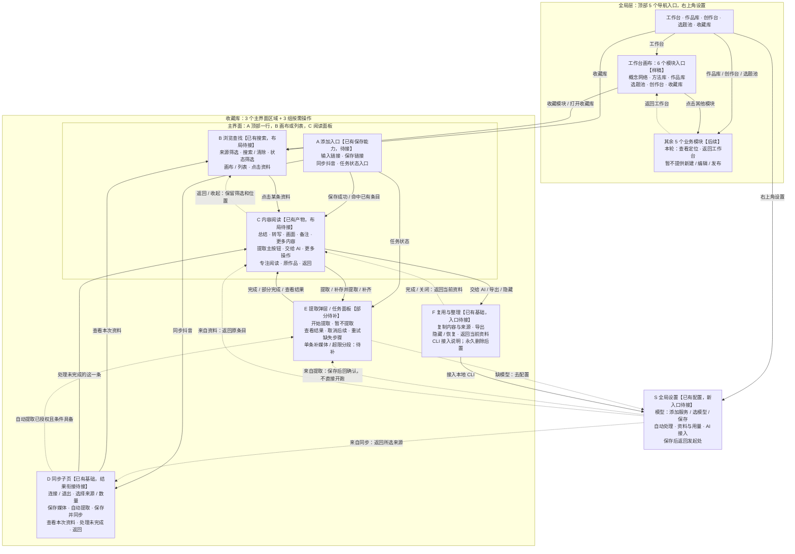
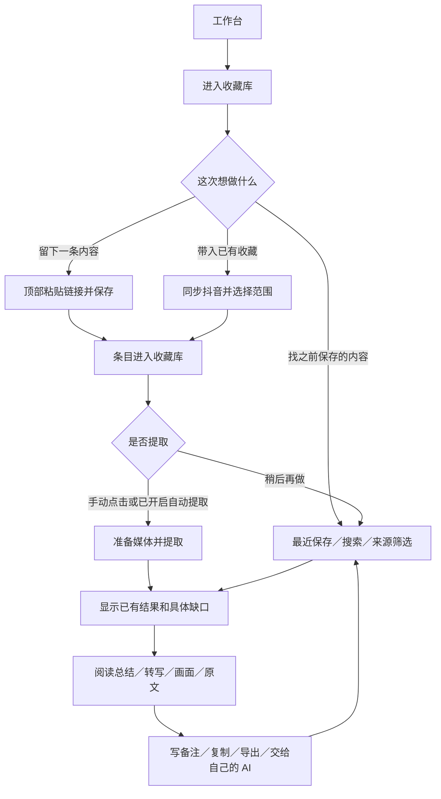
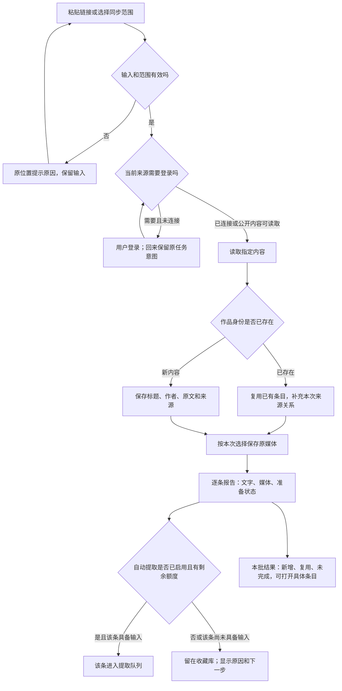
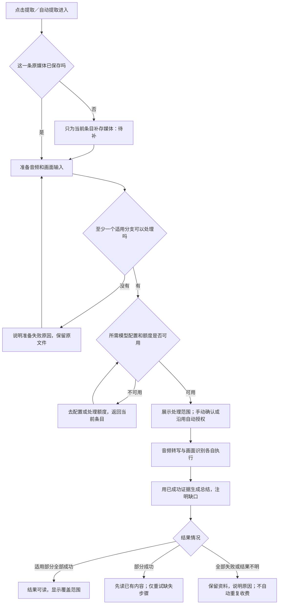

# 收藏库交互流程与能力对照

日期：2026-10-05。状态：交互审阅稿，尚未批准按本稿开发。修订 2：以“功能归属—页面区域—控件—点击去向”的一张总图作为主审阅入口。

本稿是《MVP收口-页面改动与交互验收》的交互附件，不另起架构或开发总计划。本次只读核对代码和已有验收记录，没有改应用代码、同步资料、调用模型或运行新的真实验收。

## 0. 先看这一张：产品层级、页面区域与交互总图

上一版的图 A/B/C 是处理步骤图，不能替代产品交互结构。本节取代它们作为主图；后文仍保留为分支和能力证据附件。以下是待确认的目标安排，不宣称新页面已接真实业务。

### 0.1 层级先固定，不把三种数量混在一起

| 层级 | 数量与内容 | 含义 |
| --- | --- | --- |
| 顶部主导航 | 5 个：工作台、作品库、创作台、选题池、收藏库 | 页面快捷入口；右上角设置另算辅助入口 |
| 工作台业务模块 | 6 个：概念网络、方法库、作品库、选题池、创作台、收藏库 | 工作台画布内的模块；与顶部同名入口进入同一模块，不创建两套功能 |
| 收藏库主界面 | 3 个常驻区域：A 添加、B 查找、C 阅读 | A 顶部一行；B 画布或列表；C 选中条目后的阅读面板 |
| 收藏库辅助操作 | 3 组：D 同步、E 处理、F 复用与整理 | D 是子页；E 是确认弹层和任务面板；F 从阅读工具进入，并非再新增三个一级导航 |
| 全局设置 S | 模型服务、自动处理、资料与用量、AI 接入 | 配置只在需要时进入；按入口返回原资料或同步页 |

图中：实线表示点击或完成后的去向；虚线表示条件分支/返回。框内列出实际控件。A/B/C 的位置表示页面归属，不表示用户必须顺序点完三个区域。所有“待接”均指新界面接线，不能据此把原能力说成未开发。

### 0.2 每个区域的按钮、点击结果和边界

本表使用与总图相同的 A–F/S 编号。`已有`只是旧业务能力存在，具体真实样本范围仍见 C01–C36。`样稿`没有写入真实库。`待补`是实际缺口。`后置`不提供假可用按钮。

#### A · 添加入口——收藏库顶部常驻一行

| 控件 | 点击/操作后 | 完成与异常去向 | 当前 |
| --- | --- | --- | --- |
| 链接输入框 | 接收一条抖音链接或分享文字 | 无法识别时就地报错、保留输入；不先弹新增窗口 | 已有；新布局待接 |
| 保存链接 | 提交单条保存任务；提交后可继续浏览 | 成功打开 C；重复打开同条 C；失败在 A 原位重试；需登录时去 D 并带返回意图 | 保存已有；自动打开和返回待接 |
| 同步抖音 | 打开 D，同步自己的既有收藏 | 不因打开页面立即同步 | 已有；新入口待接 |
| 任务状态入口 | 打开 E 的任务列表/详情 | 可返回正在读的 C；无任务时仅显示无运行任务 | 任务已有；紧凑入口待接 |

不在这条常驻输入栏堆数量、协议、模型或批量下载参数。保存媒体使用已设偏好；可从设置调整，不隐含模型调用授权。

#### B · 浏览查找——收藏库主体，不是另一个业务模块

| 控件 | 点击/操作后 | 完成与异常去向 | 当前 |
| --- | --- | --- | --- |
| 全部/喜欢/收藏/收藏夹/博主/单链接 | 过滤同一资料集；标题、数量、选中态同步变化 | 来源计数可重叠；总数去重；空来源给 D 入口 | 基础已有；新布局待接 |
| 搜索输入框 | 搜标题、作者和已索引正文/备注 | 无命中就地显示，不声称语义检索或未收藏过 | 已有；新布局待接 |
| 清除搜索 | 只清查询词 | 保留来源与状态条件；不清所有条件 | 基础已有；新行为待接 |
| 全部/可阅读/待处理 | 按产物状态过滤 | 部分可读允许出现在后两者中 | 样稿；真实组合待接 |
| 画布/列表 | 改同一资料集的展示方式 | 保留筛选与选中条目；不复制资料 | 样稿；待接 |
| 条目卡片/标题 | 打开 C；选中项高亮 | 宽屏就地阅读；窄屏进入单栏后可返回 | 原详情已有；新布局待接 |
| 空库“同步抖音”/“添加链接” | 分别进入 D，或聚焦 A 输入框 | 正式界面不自动填演示链接 | 样稿需改并接线 |
| 更多 → 已隐藏资料 → 恢复 | 列出隐藏项，恢复选中项 | 恢复到正常检索范围；不重新下载或提取 | 恢复已有；入口待接 |

工作台画布展开收藏是同一 B/C 的快捷入口；不另造一套收藏数据。工作台进入时保留工作台返回位置，顶栏收藏库进入时保留收藏库返回位置。

#### C · 内容阅读——当前条目的阅读面板

| 控件 | 点击/操作后 | 完成与异常去向 | 当前 |
| --- | --- | --- | --- |
| 返回/收起详情 | 回到发起阅读的 B 或工作台收藏分支 | 保留来源、搜索、状态、列表位置；不固定跳首页 | 样稿；真实待接 |
| 专注阅读/退出专注 | 收起/恢复其他区域 | 不换条目，不重置阅读位置 | 样稿；待接 |
| 原作品 | 新页打开真实来源链接 | 无地址不造链接；不触发提取 | 已有 |
| 总结/转写/画面/我的备注 | 切换当前条目对应内容 | 不存在就显示缺口和提取入口；已有部分先读 | 已有产物；新布局待接 |
| 更多内容 → 平台原文/完整阅读稿 | 在同一阅读位置切换内容 | 原产物保留，不因精简导航删掉 | 旧功能已有；新入口待接 |
| 目录/段落复制 | 在当前已加载正文定位或复制 | 长文未完整加载必须说明范围 | 组件已有；新布局待接 |
| 画面缩略图/关闭大图 | 查看原帧、原图及真实时间或序号，再返回 | 不凭模型生成假帧；图文保留原顺序 | 基础已有；真实覆盖待验 |
| 备注输入/保存备注 | 只保存自己的备注 | 版本冲突时保留输入；未保存离开可保存/放弃/继续编辑 | 版本基础已有；离开提示待补 |
| 状态主按钮 | 依据状态进入 E，具体标签见下表 | 同一时刻只给一个主动作，不能并排堆六个提取按钮 | 部分已有、部分待补 |
| 交给 AI/更多操作 | 进入 F 的对应小面板或菜单 | 不离开当前条目的上下文 | 基础已有；新入口待接 |

**C 的主按钮随状态变化，不是新增六个按钮：**

| 状态 | 主按钮/运行态 | 点击后 |
| --- | --- | --- |
| 已保存文字、缺原媒体 | 保存媒体并提取 | E：确认仅这一条补存与提取，真实待补 |
| 已有可用输入、无提取结果 | 提取内容 | E：显示处理范围；缺配置才跳 S |
| 原媒体已存、准备失败 | 重试准备 | E：仅重试对应音轨/选帧准备，保留有效文件 |
| 部分结果成功 | 补齐未完成内容 | E：列明缺口，复用成功结果 |
| 正在处理 | 正在提取 / 查看进度 | E：打开已有任务，不新增请求 |
| 完整可读 | 交给 AI | F：复制与复用；重跑收在更多里且需另行确认 |
| 请求结果/费用不明 | 查看任务 | E：核实后再决定，不能直接自动重发 |

#### D · 同步——收藏库子页（账号与来源不拆成多个难找的入口）

| 控件 | 点击/操作后 | 完成与异常去向 | 当前 |
| --- | --- | --- | --- |
| 连接抖音/重新连接 | 用户在独立浏览器登录，回来显示账号与可选来源 | 不把一次连接拆成多次独立验证；失败保留原范围 | 登录已有；返回体验待接 |
| 退出登录 | 退出本产品抖音连接 | 不删资料；换账号后先确认所选来源范围 | 代码/隔离验证已有；真实换号待验 |
| 来源勾选 | 喜欢、全部收藏、指定收藏夹、指定博主 | 指定夹才显示夹选择器；指定博主才显示主页输入框 | 已有；真实博主待验 |
| 刷新收藏夹 | 只更新可选夹列表 | 刷新失败不把账号改成未登录 | 基础已有；状态表达待接 |
| 数量、保存原媒体 | 设置本次/该来源范围 | 大文件失败只影响相应条目，原文保留 | 已有 |
| 新增自动提取开关 | 设置后续新增资料的处理意图 | 无模型引导 S；解释额度范围；不补跑历史资料 | 代码已有；全链待验 |
| 保存并同步（已有来源为“立即同步”） | 保存合法来源并立即执行所选范围 | 无需先保存、再去别页找同步；提交后显示运行态 | 两个能力已有；合并按钮衔接待接 |
| 仅保存 | 只保存来源与规则 | 不创建同步/模型任务，留在 D | 已有；目标层级待接 |
| 自动同步/频率 | 设置来源定时规则 | 与新增自动提取分开；不会自动给模型授权 | 代码已有；新入口待接 |
| 本次结果/查看本次资料 | 区分本批新增、复用、未完成；按本批 refs 打开 B | 不能把累计量冒充本批；空批次解释原因 | 结果契约/界面待补齐 |
| 处理这一条 | 在 C 打开相应未完成条目 | 只解决这一条，不全夹重跑 | 新衔接待接；补存待补 |
| 编辑/停止定时/移除来源 | 修改来源规则或移除未来同步 | 已保存资料保留；停止定时不冒充取消正在跑的任务 | 代码已有；新入口待接 |
| 返回收藏库 | 回发起处 B/C | 保留筛选和位置；后台任务继续 | 样稿；真实待接 |

从 A 因登录不足进入 D，只恢复 A 的单条意图，不自动执行 D 的整个同步范围。

#### E · 处理——确认弹层和任务面板，不占一个一级主导航

| 控件 | 点击/操作后 | 完成与异常去向 | 当前 |
| --- | --- | --- | --- |
| 开始提取/暂不提取 | 展示条目、步骤、模型、上传内容和请求上限后提交，或关闭 | 关闭确认不产生调用；已授权自动任务不逐条重复弹窗 | 基础已有；新布局待接 |
| 去配置模型 | 带当前条目与处理意图进入 S | 配完返回 E 确认，不自动开始未授权调用 | 旧返回参数/样稿已有；全链待接 |
| 任务筛选/查看详情 | 查看保存、同步或提取的实际阶段 | 具体条目和具体缺口可达，不只显示统一失败 | 任务已有；新紧凑面板待接 |
| 查看结果 | 返回相关 C；批量回本次资料 B | 部分完成也可读，不强制等全部成功 | 基础已有；衔接待接 |
| 取消后续步骤 | 停止尚未执行的后续工作 | 保留成功结果；已发请求可能收费，不说成退款 | 代码已有；恢复待验 |
| 重试缺失步骤/补齐 | 明示范围后重试失败项 | 不重跑成功分支；未知计费结果先核实 | 代码已有；缺口和新入口待接 |
| 关闭面板 | 回 B/C/D 发起位置 | 不取消已提交任务，刷新后能找回 | 目标交互待接 |

历史资料批量处理从任务面板选择明确范围并确认；开启“新增自动提取”不等于全库处理。长视频分段能力未补好前，明确阻塞及保留状态，不提供假成功。

#### F · 复用与整理——从阅读工具进入，操作后留在当前资料

| 控件 | 点击/操作后 | 完成与异常去向 | 当前 |
| --- | --- | --- | --- |
| 复制当前内容 | 复制当前产物与来源 | 标明当前加载范围；失败可手选复制 | 复制基础已有；范围提示待接 |
| 交给 AI → 复制内容与来源 | 预览并复制资料、来源及提取缺口 | 用户自行粘贴到自己的 AI；不偷偷发给另一模型 | 样稿/基础已有；待接 |
| 导出 → 文字/含媒体 | 明确格式与包含范围后导出 | 缺附件列明；不宣称等于整库备份 | 已有；新入口待接 |
| 更多 → 隐藏 | 确认后从正常检索排除，文件保留 | 返回 B；可从 B 的已隐藏资料恢复 | 已有；新入口待接 |
| 接入本地 CLI | 到 S 的 AI 接入说明，保留条目返回路径 | 不能承诺普通网页聊天能读本机 | CLI 已有；新路径待接 |
| 关闭/返回当前资料 | 回到同一 C、同一产物 | 不统一跳设置首页或清空资料选择 | 样稿部分已有；需统一 |

永久删除、回收站与“加入选题”不是当前可用操作；后置，暂不出现在可点击菜单中。隐藏与导出不能包装成这些功能已经实现。

#### S · 全局设置——服务于上面的操作，不抢占首次保存流程

| 控件组 | 包含哪些控件 | 保存后与边界 | 当前 |
| --- | --- | --- | --- |
| 模型服务 | 添加服务、选择供应商、凭据、选择模型、测试、保存/取消；自定义兼容协议放高级项 | 按需指定音频/视觉/总结默认用途；测试若调用模型要明示；不在普通入口要求手填所有协议参数 | 已有配置及部分真实模型验证；新入口待接 |
| 自动处理 | 默认保存媒体、新增自动提取、条数/请求额度、保存 | 来源自动同步在 D 管理；两开关不混淆；不静默扩大历史范围 | 代码已有；交互归属待接 |
| 资料与用量 | 资料位置、已登记空间、用量记录、查看缺口、备份/恢复入口 | 备份恢复需专项核验后才能当成可用；未知金额显示未知 | 基础已有；备份待专项核验 |
| AI 接入 | 复制安装说明、复制已安装使用说明、返回资料 | 仅给用户可执行的 CLI 指引，不默认加 MCP 页面或内置问答 | CLI/说明已有；新入口待接 |
| 返回发起处 | 从提取来回 E；从 D 来回 D；从 F 来回 C；全局直接来回原模块 | 带回未提交意图，保存设置不等于同意立刻同步或计费 | 待统一接线 |

### 0.3 同一张图上的正常路径和异常落点

| 用户行为/边界 | 在图上怎么走 | 保留什么 |
| --- | --- | --- |
| 第一次保存一条 | 顶部收藏库 → A → C → E（必要时 S → E）→ C → F | 内容、条目、来源、配置后的返回位置 |
| 批量带入收藏 | A → D → 连接和选择 → 保存并同步 → 本批 B → C | 所选范围；成功条目独立可读 |
| 回来找资料 | 顶部收藏库 → B → 搜索/筛选 → C → F → C/B | 查询条件、阅读位置，不重复提取 |
| 收藏已有作品 | A/D → 已有 C/B | 同一作品、全部来源；不重复计费 |
| 登录失效或夹列表失败 | A/D → D；修复后回原操作 | 历史资料、输入和所选范围；夹读取失败不抹掉连接 |
| 缺原媒体/准备失败 | C → E（补存或仅重试准备）→ C | 已有文件和可读产物；两种错误不同提示 |
| 同步部分完成 | D → 成功项 B/C；失败项 C → E | 不让一条失败拖住整批 |
| 提取部分完成/额度不足 | E → C 先阅读；仅有需要才去 S/E | 成功分支与缺口；不自动换更贵模型 |
| 重复点击/刷新/任务掉线 | A/C → 已有 E | 同一任务；结果不明时不直接重复调用 |
| 外置盘不可用 | A/D/E 原位置提示，恢复后重试原动作 | 不初始化新空库，不删既有资料 |
| 备注未保存/版本冲突 | 留在 C，保存/放弃/继续编辑或重新核对版本 | 用户原输入；不让后台结果覆盖备注 |
| 返回与窄屏 | C 返回 B，D/E/F/S 回发起处 | 所有核心按钮可点；不依赖悬停；不丢筛选 |

完整的 27 类边界及 36 项能力证据继续见下文，按 A–F/S 作为 UI 归属审阅。后续只要审阅某个按钮，必须能回答“在哪一块、点了做什么、完成去哪、失败留哪、现在是否真能用”。

## 1. 先分清“设计目标”和“当前实现”

- **已有实测**：此前记录有真实样本证据，严格限定在记录的样本、来源和环境；不是全场景通过，也不是今天重新验收。
- **代码已有**：本次找到相关接口、页面或处理逻辑；尚不能据此认定真实体验已通过。
- **仅样稿**：8814 可点击演示，状态保存在内存，刷新重置。
- **待补**：目标路径目前存在缺口；后文标注的应有行为是设计，不是现状。
- **后置**：本批不开发，但写清产品边界，避免承诺错位。

目前 8814 是新结构样稿；8790 是已有业务界面。下列流程图表达目标交互，具体实现状态以第 6 节逐项对照为准。

## 2. 普通用户应该怎样使用

### 2.1 第一次：先留下一个内容，再按需提取

从工作台进入收藏库。空库只给两个入口：顶部粘贴链接；旁边“同步抖音”。不要求先理解模型、任务队列或 CLI。

保存链接后立即知道“保存了什么”。需要平台登录时才引导登录；需要云端提取时才引导配置模型。仅阅读已有结果不要求模型 Key。

### 2.2 日常：先找回和阅读，添加入口保持一行

进入收藏库默认看最近保存的内容，能辨认标题、作者、来源和可读状态。搜索/来源/状态筛选后打开条目；返回保留条件和列表位置。阅读首屏优先显示已有正文，缺口用短状态和对应按钮表达。

### 2.3 批量用户：先选择范围，再看本次结果

连接抖音 → 选择喜欢/收藏/具体收藏夹，或指定博主 → 选择数量与是否保存媒体 → 同步。完成后直接看本批资料；成功资料先可读，失败资料单独处理。自动同步和自动提取是两个独立开关。

### 图 A：用户主流程

保存、提取、阅读各自可以完成：保存成功不等于已经转写；部分可读不等于全片已识别；阅读不触发重新计费。

## 3. 保存和同步：具体分支

### 图 B：从入口到已保存资料

约定：重复同步不产生第二份作品；同条可以同时来自喜欢、收藏夹和博主。来源计数允许重叠，总资料数去重。本次数量和累计数量分开。不把首次入库时间当真实点赞/收藏时间。

单链接保存成功后打开当前条目；批量同步保留在结果页，由用户打开某条。去登录/设置后保留链接、所选范围与返回位置，授权恢复后不自动扩大范围或启动未确认费用。

## 4. 提取：单条闭环与部分完成

### 图 C：一条内容如何变成可读结果

图中“各自执行”指失败隔离，并不承诺同时并发。视频没有音轨标“不适用”；音轨准备出错标“失败”，不能混称。图文按原图顺序处理图片；不机械添加转写任务。画面数量超限的分段处理仍待补。

### 三种容易混淆的状态必须拆开

| 真实情况 | 用户看到什么 | 主动作 |
| --- | --- | --- |
| 只有平台文字，未保存视频/图片 | 已保存原文，原媒体未保存 | 保存媒体并提取 |
| 原媒体已保存，选帧或音轨准备失败 | 原媒体已保存，某一准备步骤未完成 | 重试准备；可用分支先处理 |
| 已有音频或画面结果，某个分支失败 | 部分内容可读；明确缺哪部分 | 查看结果／补齐未完成内容 |
| 有总结，但画面仅抽样或证据缺失 | 总结可读；画面覆盖不完整 | 查看覆盖详情／补齐 |
| 请求已发出但没有确定返回 | 本次结果待核实，可能已产生费用 | 查看任务并处理，禁止静默重发 |

当前真实 `process-preview` 在缺少 `prepared_input` 时统一报“尚未保存原媒体”，不能据此区分前两种情况。这是需要改的业务及提示契约，不能仅替换一句文案。

## 5. 页面、按钮与返回位置

| 页面/区域 | 用户应看到的重点 | 主动作及去向 | 返回时保留什么 |
| --- | --- | --- | --- |
| 工作台 | 六个模块，收藏仅其中之一 | 收藏库 → 资料列表；画布可下钻阅读 | 当前模块 |
| 收藏库空态 | 一行添加链接；同步已有收藏入口 | 保存链接／同步抖音 | 未提交链接 |
| 收藏库列表 | 标题、作者、来源、入库时间、结果状态；搜索与筛选 | 打开某条；添加链接；同步 | 来源、查询、筛选、滚动位置 |
| 阅读详情 | 已有正文；总结/转写/画面/备注；原文和完整阅读稿可达 | 状态决定“提取、补存、补齐、重试”；复制/原作品为辅助 | 当前条目、产物页签、阅读位置 |
| 单条提取确认 | 处理哪一条、缺什么、是否上传媒体、选用模型、预计请求上限/未知金额 | 确认后异步处理；取消回原条目 | 不清已保存内容，不因关闭面板取消任务 |
| 同步 | 账号、所选范围、数量、是否存媒体；本次结果 | 同步所选；逐条查看结果；失败条目定位 | 所选来源与数量 |
| 任务 | 排队、运行、完成、失败/阻塞及阶段原因 | 查看资料；取消后续步骤；确认后重试失败部分 | 原条目与原筛选 |
| 设置 | 模型服务、默认模型、自动处理、资料位置和用量 | 配置后回到发起操作处 | 返回路径与未执行意图 |
| AI 接入 | 本次复制内容与来源；以后由本地 CLI 检索 | 复制交接内容／安装或使用说明 | 回到当前资料 |
| 更多/数据 | 导出、隐藏/恢复、接纳本地修改、空间与备份 | 每个操作明确影响，不占据日常阅读首屏 | 当前资料与版本 |

“总结可读”和“待补齐”允许同时成立；筛选结果不应互斥地漏掉这类条目。目录与复制仅覆盖当前已加载正文时必须明示，不能把截断正文称为全文。

## 6. 全量能力对照：收藏库当前范围

“新界面”指本次确认的工作台结构及其收藏模块。下表共 36 项；同一行分别说明已有基础和待完成部分，避免把后端存在等同于新界面可用。

| ID | 能力/交互 | 当前证据与状态 | 仍需完成 |
| --- | --- | --- | --- |
| C01 | 工作台与独立收藏库入口 | 仅样稿；顶部模块与六节点已点验 [E1] | 按确认结构接现有业务 |
| C02 | 空库与顶部单行添加 | 旧页面代码已有；新样稿可演示 [E4] | 新入口一致接线，成功后打开条目 |
| C03 | 抖音分享文字/单链接保存 | 已有公开视频实测；持久任务和页面已有 [E3,E4] | 新布局接入，去重/登录分支完整复验 |
| C04 | 登录、刷新收藏夹、退出 | 账号和七个收藏夹有实测；退出有代码与隔离验证 [E2,E5] | 新界面返回原操作；真实退出/换账号另验 |
| C05 | 本人喜欢同步 | 有小批真实成功记录 [E2] | 新页面接入，增量与覆盖继续对照 |
| C06 | 全收藏、指定收藏夹同步 | 两来源各五条有实测，媒体部分完成 [E2] | 全过程不误报全成功；新结果页面接入 |
| C07 | 指定博主作品 | 解析/范围/同步代码已有 [E5] | 本轮未找到可覆盖完整新流程的成功验收，需真实补验 |
| C08 | 视频与图文 | 视频小样本已通；图文分支已有 [E2,E3] | 图文原图顺序、缺页与完整提取真实补验 |
| C09 | 多来源去重与来源关系 | 真实收藏和夹内条目复用；库逻辑已有 [E2] | 返回同条资料，准确显示不同来源和计数 |
| C10 | 保存/不保存原媒体 | 默认选项、来源选项、实际视频下载已有 [E2,E4,E5] | 将原媒体与准备状态分别展示 |
| C11 | 单条缺媒体补存后提取 | 仅样稿；真实预检仍直接拒绝 [E6] | 新增单条可恢复闭环，不要求全夹重同步 |
| C12 | 已存媒体、准备失败 | 分支结果保留已有；当前预检提示不够准确 [E6,E7] | 识别具体准备阶段并提供对应重试 |
| C13 | 模型供应商与默认模型 | Pi/兼容协议与设置已有；MiMo 三用途有真实调用 [E2,E7] | 新入口保留设置能力；不是所有供应商都真实验过 |
| C14 | 去配置再回当前条目 | 旧页面已有返回参数；样稿模拟过 [E1,E6] | 新界面完整返回链路、模型有效性与费用确认复验 |
| C15 | 音频转写 | 一条真实视频转写和总结已通 [E7] | 更多语音/长视频质量，时间对齐不得虚构 |
| C16 | 画面识别 | 三张原帧视觉提取已通 [E7] | 不能视作全片覆盖；完整自动选帧仍需验 |
| C17 | 选帧超限与大文件 | 目前会明确阻塞，不静默裁剪 [E2,E7,E8] | 分段、覆盖汇总、合理大小策略和可操作提示 |
| C18 | 音频/画面独立、部分总结 | 已有真实“画面准备失败但音频可用”验证 [E7] | 新页面按产物显示状态，补齐失败部分 |
| C19 | 手动提取、确认与运行状态 | 旧页面/任务接口已有；新样稿演示 [E6,E9] | 防重复点击、后台运行、刷新恢复的新界面验收 |
| C20 | 自动提取新增资料 | 代码已有，独立开关和条数/请求上限 [E9] | 当前额度用尽/准备受阻的清楚提示；真实整链验收 |
| C21 | 自动同步与来源编辑 | 代码已有，按来源保存定时规则 [E5] | 新设置层级、时间/状态显示和运行验收 |
| C22 | 历史资料分批提取 | 任务页选择、计划和确认已有 [E9] | 新入口中可选范围；不因开自动开关突发全库计费 |
| C23 | 重试、取消、未知计费结果 | 阶段与任务处理代码已有 [E9] | 新页面明确作用范围，成功步骤复用与中断恢复复验 |
| C24 | 总结/转写/画面/原文/完整稿 | 原页面与真实样本有结果；新样稿只有部分摘编 [E6,E7] | 新阅读区接全部真实产物，不删原文/完整稿 |
| C25 | 连续阅读、专注阅读、返回 | 仅新样稿完成目标布局；旧页面已有独立详情 [E1,E6] | 新真实页面保留筛选、位置与当前条目 |
| C26 | 关键词搜索/来源筛选 | 真实接口及页面已有 [E6] | 新布局接线；“可阅读/待处理”组合筛选目前仅样稿 |
| C27 | 我的备注与本地正文修改 | 备注版本写入、本地修改接纳已有 [E6,E10] | 新界面保留冲突处理和索引更新，禁止静默覆盖人工修改 |
| C28 | 复制、导出与来源 | 原界面复制、文字/含媒体导出代码已有 [E6,E10] | 新“复制给 AI”带足来源和缺口，完整/已加载范围分清 |
| C29 | CLI 供用户 AI 搜索读取 | CLI 与使用说明已有；当前不增加 MCP 界面 [E11] | 新设置入口、真实宿主“提问→查到→引用”验收 |
| C30 | 隐藏与恢复 | 页面/接口已有；隐藏影响检索且保留文件 [E10] | 新界面保留；不要把隐藏说成删除或节省空间 |
| C31 | 永久删除、回收站、媒体清理 | 当前接口明确不支持永久删除 [E10] | 功能待补，交互先规划，不能展示假可用按钮 |
| C32 | 用量、缓存、金额、剩余自动额度 | 任务用量/缓存字段与剩余条数代码已有 [E9] | 新页面准确显示未知金额，不当成供应商实际账单 |
| C33 | 资料路径、空间、文件缺口 | 页面与已登记文件计量已有 [E10] | 不把登记量当全盘占用；磁盘离线/满盘可恢复提示 |
| C34 | 整库备份与异路径恢复 | 已有开发记录和分项实现线索，本次未完整复核 | 待专项核验；不能把单条导出宣称为整库备份 |
| C35 | 新手安装、Mac/Windows/Linux | 本机开发页可运行；完整三端首用仍有缺口 [E12] | 单列发行验收，本次流程图不宣称小白安装已完成 |
| C36 | 全链路真实验收与开源发布 | 本批只有流程规划；旧测试/实测各自有边界 [E7,E12] | 新界面全链路、相关回归、三端与干净发行；发布另确认 |

### 已知缺口不能只归类为“未验收”

1. C11 单条补存到提取是真实交互及后端缺口。
2. C12 缺媒体与准备失败被同一提示覆盖，属于状态契约缺口。
3. C17 自动画面超限尚无完整可用处理闭环，大文件也有已知阻塞。
4. C01/C25/C26 新布局和状态筛选仍在样稿，未接真实业务。
5. C31 永久删除/回收站不是现有隐藏功能，不能混称已支持。

其他项中标“代码已有”的，主要工作是保留、接入和验收，不重新写一遍。

## 7. 边界情况：用户看见什么，下一步去哪里

下表是目标处理规则。具体规则已有多少代码，以第 6 节为准，不能把本表当验收通过记录。

| ID | 边界/异常 | 用户看见与可执行下一步 | 必须保留/避免 |
| --- | --- | --- | --- |
| B01 | 空输入、非抖音、多条混贴或无法识别 | 输入框旁指出问题；一次一条，多条要求拆开 | 保留用户输入，不跳去任务页找原因 |
| B02 | 重复链接/重复同步/不同来源同作品 | 打开已有条目；说明来源已关联 | 不重复存储，不重复计费提取 |
| B03 | 登录过期、验证码、账号切换 | 连接区处理后回原任务；账号改变核对范围 | 不把网络问题说成退出登录，不删除历史资料 |
| B04 | 登录成功但收藏夹发现失败/无收藏夹 | 账号保持已连接；喜欢/收藏仍可选择；允许刷新夹列表 | “没有”与“读取失败”分开 |
| B05 | 某来源私密、删除、权限不足或无作品 | 显示无法读取/确实为空；用户更换来源或停止 | 不用其他推荐内容凑结果，不绕过权限 |
| B06 | 同步为零 | 分清没有新增、全是重复、来源为空、获取失败 | 不把四种情况统一显示“0 成功” |
| B07 | 同步部分完成 | 本次成功项可查看，失败项逐条说明和重试 | 不因为一条失败阻断其他成功项 |
| B08 | 用户在抖音取消喜欢/收藏 | 本地已保存资料仍保留；来源变化按实际观察说明 | 不推断用户删库意图，不自动删除 |
| B09 | 单条原媒体未保存 | “保存媒体并提取” | 不要求重新同步整个夹 |
| B10 | 原媒体保存了但准备失败 | “原媒体已保存；音频/选帧待处理”，可重试准备 | 不重复下载有效文件，不误报“未保存原媒体” |
| B11 | 下载403/过期地址/网络断开/超大小限制 | 明确当前失败原因；按已有受控规则重试这一条 | 已保存原文保留，不能裁剪文件后报完整成功 |
| B12 | 画面太多、候选帧超限 | 提示需分段；展示待覆盖区间和处理范围 | 分段闭环待补；不丢页，不把三帧抽样称为完整 |
| B13 | 无音轨/图文/静态页无文字 | 适用的分支继续；不适用的明确标注 | 准备错误不冒充无音轨，OCR无文字不代表画面无信息 |
| B14 | 没有模型配置、模型不支持输入 | 一次配置所需用途；返回当前条目确认处理 | 不要求只想阅读的用户先填 Key |
| B15 | 模型余额不足、限流、超时、拒绝请求 | 保留当前结果，解释原因；明确可重试范围 | 不自动切换更贵服务，不无限重试 |
| B16 | 自动提取关闭或授权条数用完 | “等待手动提取”或“本轮额度用完”，可查看设置 | 不静默跳过，不把历史资料突然纳入新授权 |
| B17 | 同一条正在处理、反复点击、刷新页面 | 回到已有任务，按钮显示运行态；刷新恢复 | 不重复提交；关阅读面板不取消后台任务 |
| B18 | 取消任务、应用退出或后台掉线 | 显示已完成与未完成；后台恢复后检查任务状态 | 已发出请求可能收费；结果不明不能当成未调用 |
| B19 | 外置盘离线、磁盘满、文件丢失 | 就地提示盘/空间/文件问题，恢复后刷新或重试 | 不自动初始化新空库，不清除成功资料 |
| B20 | 仅部分产物成功、有总结但画面不全 | 先阅读；缺口、覆盖范围和可重试步骤明确显示 | 不让“有总结”覆盖质量警告 |
| B21 | 人工修改与模型重跑冲突 | 提示版本变化、重新载入或确认接纳修改 | 不覆盖自己的备注和已确认人工正文 |
| B22 | 搜索无结果 | 检查筛选、换词；区分未提取、索引覆盖不全、确实未命中 | 不声称已做语义检索，不推断用户从未收藏 |
| B23 | 结果过期或长文尚未加载完 | 标“需更新”/“已加载部分”，允许继续读 | 复制/目录不冒充覆盖全文 |
| B24 | 剪贴板被拒绝、导出缺媒体 | 提供选中文字复制；导出列出缺失和范围 | 不静默遗漏后报完整导出 |
| B25 | AI 无法访问本机/CLI 未安装 | 给安装/使用说明或复制内容路径 | 普通网页 AI 不宣称能直接读本地文件 |
| B26 | 隐藏、恢复、移除同步来源 | 明确是否影响检索、定时任务与磁盘文件 | 隐藏不等于删除；移除来源不删除已存资料 |
| B27 | 窄屏、浏览器后退、切换资料 | 单栏阅读可返回；保留筛选和位置；不弹出多层无关页 | 所有核心动作可见，不依赖悬停 |

## 8. 本批之外也明确列出

| 能力 | 定位与状态 |
| --- | --- |
| 选题池、创作台、自己的作品库 | 工作台入口已定，业务后端后续分批；本期只做结构预览 |
| 概念网络、方法库、跨内容引用/反链 | 规划中；现有来源关系不是内容知识图谱 |
| 语义/向量检索与内置问答 | 本批不增加；当前以关键词检索和用户自己的 AI 为主 |
| 自动长期偏好画像 | 不默认创建；喜欢/收藏仅作为兴趣线索 |
| 用户自建本地收藏夹/标签体系 | 不能把抖音收藏夹筛选当成本地文件夹 CRUD；本批未决定新增 |
| 小红书、微信、PDF/Word 导入 | 新产品首发仍限抖音，旧内部系统能力不冒充新产品已支持 |
| MCP 页面、远程服务器接入 | UI 当前优先 CLI；远程/发行门槛单列，不进入普通用户首个保存流程 |
| 平台发布、排期、商业化账单 | 后置；提取结果不会自动发布 |

## 9. 下一步审阅与执行顺序

本图编写时只确认交互；用户随后授权继续，已补齐 8814 的可点击样稿，未修改 8790 的生产前后端。建议审阅顺序：

1. 先看图 A，确认普通用户的入口与日常路径。
2. 看图 B/C，确认单条补存、自动/手动、部分完成与费用边界。
3. 对照第 5 节确定页面职责和每个主按钮，不增加大段教学说明。
4. 现可在 8814 点验主要路径（详见下方进展）；样稿审阅通过再接后端并补真实缺口。
5. 实体验收按“单条保存→单条提取→阅读/找回/AI复用”，再覆盖批量与异常。已有测试不能替代新整合链路。

### 2026-10-05 本轮执行结果：交互样稿已补齐主要路径

后续视觉与连续性修订：用户指出独立收藏阅读与首页风格割裂。8814 已共用同一阅读表面与控件，首页小卡增加「展开阅读」→ 同条完整阅读 →「返回工作台预览」；支持保留当前标签、搜索、条目与画布路径。展开状态进入 URL，浏览器后退可恢复。独立从收藏库进入则返回收藏库，不伪造首页来源。样稿39项测试与宽窄屏点验通过，生产接线状态不变。

| 大块 | 本轮落地到 8814 的交互 | 验证层级 |
| --- | --- | --- |
| A 添加入口 | 单行保存、作品链接校验、重复打开已有条目 | 浏览器空库保存 + 状态测试；无真实入库 |
| B 浏览找回 | 来源/状态/搜索、列表/画布切换、隐藏恢复、本次批次筛选 | 浏览器与状态测试；不是生产检索验收 |
| C 阅读 | 总结/转写/画面/备注，更多原文与阅读稿；按当前状态给主动作 | 浏览器点验；已有样本仍标注覆盖边界 |
| D 同步 | 连接状态、来源范围、指定夹/博主、媒体与自动开关、仅保存/同步、本次新增复用结果 | 空库选择三来源得 4 条新增、1 条缺媒体、3 条自动模拟；再次同步 0 新增/4 复用，不新增提取任务 |
| E 提取与任务 | 单条补存确认、配置返回、进度、取消、重试、准备失败、未知结果不重发 | 浏览器逐项点验 + 取消旧回调测试；没有真实下载或模型请求 |
| F 再利用 | 复制带来源、导出文字范围、隐藏/恢复、CLI 说明 | 浏览器验证复制来源与覆盖边界、隐藏恢复、缺媒体导出提示；未验证真实媒体包 |
| 全局设置 | Pi SDK 供应商选择/兼容协议、用途模型、表单检查、自动额度、位置/用量边界 | 离线目录与占位输入；不收真实 Key，不假装连接成功 |

验证：独立构建成功，36 项状态/结构/隔离契约测试通过；宽屏 1440×900 与窄屏 390×844 点验，无横向溢出或浏览器 error/warn。备注保存后可返回原条目；样稿重置与刷新会清空本轮模拟。

尚未纳入本轮真实验收：收藏夹发现失败/来源私密、无音轨判定、磁盘故障、帧超限分段、真实模型报错/费用、版本并发、完整媒体导出、备份恢复、重启续跑和 Windows/Linux 原生运行。B01～B27 是验收目标，不能因本轮样稿通过而整表勾完成。

下一步仍按既定顺序：用户审阅交互 → 用现有业务替换模拟状态 → 单条闭环真实验收 → 批次与异常验收。其他创作模块只保留规划入口。

## 10. 本次核对依据

- E1：[交互样稿与结构记录](2026-10-05-MVP收口-页面改动与交互验收.md)，以及 `frontend/prototypes/collection-flow/`。当前新结构仅样稿。
- E2：[实施与实际验收记录](2026-10-01-抖音上下文MVP-实施与实际验收记录.md) 的 2026-10-03 登录、收藏夹、同步修复段。历史段按时间区分，不沿用早期失败概括当前状态。
- E3：[自有单链接实测](2026-10-01-统一后端-自有抖音单链接实测.md)。只使用其中公开视频证据，后续状态以 E2 为准。
- E4：`frontend/src/LinkComposer.jsx`；恢复添加任务、提交单链接、媒体选项。
- E5：`frontend/src/management/Sources.jsx`；来源范围、连接、博主、定时与移除。
- E6：`frontend/src/Library.jsx`、`frontend/src/lib/library-presentation.js`、`backend/src/collection_context/application/management.py`；阅读、状态、来源搜索及 `process-preview`。
- E7：[AI 接入与独立分支实测](2026-10-04-AI接入与独立提取分支实测.md)。一条视频、三张抽样帧，不能外推完整视频覆盖；全量测试存在失败记录。
- E8：`backend/src/collection_context/processing/ocr_selection.py`；超限会抛 `frame_limit`，不自动分段消化。
- E9：`frontend/src/management/Tasks.jsx`、`Settings.jsx`、`backend/src/collection_context/workflows/scheduling.py`；自动、历史、预算、任务和用量。
- E10：`frontend/src/LibraryTools.jsx`、`backend/src/collection_context/application/library_management.py`；隐藏、恢复、导出、修改与空间；永久删除明确不支持。
- E11：`frontend/src/Access.jsx`；本地 CLI 使用说明和宿主能力边界。
- E12：[开发总计划](2026-10-01-抖音上下文MVP-开发规划与分阶段验收.md) R01～R14 与对应实施记录；计划与实际验收分开。
