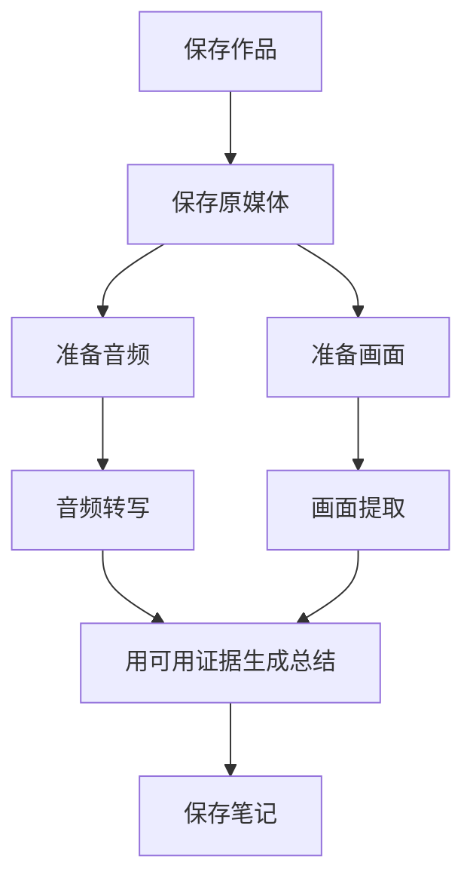

# 内容任务与状态统一

用户任务以一条作品为单位。保存、准备、云端提取与重试属于同一内容的运行记录，前端合并显示；内部任务与调用账本保留。

## 用户路径

- 内容任务列表：每条内容一行，显示当前阶段、步骤进度；点击查看进度。
- 内容详情：保存作品 → 保存原媒体 → 准备音频与画面 → 音频转写 → 画面提取 → 内容总结 → 保存笔记。
- 每一步分别展示状态与数量。成功的转写可以直接阅读；失败的画面不使转写变成失败。
- 对应步骤旁重试。重试预览自动选择这一类未完成步骤，并重新生成受影响的下游；完成阶段复用。
- 本地准备缺口在准备步骤重试；媒体已经缓存时从缓存准备，不重新下载。
- 转写/提取提交后进入同一内容的任务详情；正在运行时可以关闭弹窗，后台继续执行。
- 来源同步与系统记录默认折叠；各次内部运行收进内容详情的历史记录。
- 内容页的查看处理进度直接打开当前内容；详情中的查看转写/画面/总结打开相应页签。

## 本轮确认并修复的问题

1. 运行记录直接充当用户任务：按 material_ref 聚合；未取得作品 ID 的同链接尝试先按链接聚合，取得 ID 后合并。
2. 内容页只读前 20 个任务：读取全部运行分页，同一内容的较早任务也能显示。
3. 没有 prepared_input 就要求保存媒体：区分原媒体缓存与准备好的音频/画面，原文件存在时提供本地准备。
4. 成功转写的状态接口超限：OCR 原始审计被重复附在每个产物的 coverage。页面状态与正文读取只返回数量及覆盖元数据，原审计保留。
5. 常驻后台找不到 Node：运行环境不继承交互 shell 的 PATH，导致 Pi 画面/总结阶段报 model_runtime_missing；加入 macOS 常见安装位置解析。最小 PATH 下离线 SDK 目录读取成功（42 个服务商），未调用云端。
6. 只转写音频被记为画面失败：显式 audio_only 的画面阶段标不适用，保持旧计划描述兼容，不把主动跳过当失败。
7. hash 导航只改 URL 而没有更新组件：针对 hash 路由发送 hashchange，点击查看结果即时更新。
8. 长串失败帧编号挤在正文开头：已知系统前缀收进处理记录与覆盖说明，原文与复制内容保留。

## 验证

- 后端相关回归 139 passed，包含真实本地 SDK 到模拟服务的协议测试，无付费模型请求。
- 前端 151 passed，正式静态构建通过。
- 真实库中 10 条内容各一行，同步与系统记录另收起。
- 当前商业模式视频：媒体已保存、准备 2 段音频 / 183 张画面、转写 2/2 完成、画面与总结为旧失败待重试。
- 状态响应从包含完整 OCR 审计的大结果缩小到约 13 KB；已有转写真实可读。
- 实际点击查看转写进入对应页签；回到处理进度进入同一内容；总结重试预览为 1 次新模型请求，未点击确认提交。

本轮只修界面、状态读取和执行环境，没有自动重跑用户现有失败提取。后续由用户在对应步骤确认重试。

## 分支、复用与真实执行状态补充

用户继续指出：排队与执行混在一起；准备步骤详情缺少及时状态；直线图错误表达音频与画面的关系；切换范围或补做画面造成已有转写变旧。此次修正规则：

- 默认音频与画面，也可选择仅音频。仅音频跳过本次画面处理，已有帧和画面正文保留。
- 图表示分支依赖，不宣称同时发起所有模型请求。当前单工作器仍按资源顺序执行；实际执行的节点才转圈，排队用时钟。
- 原媒体只保存一次。准备任务执行前就登记分支状态，扫描/OCR 的阶段和数量进入记录；详情每 2 秒更新，并把新状态同步到外层任务。
- 提交后立即显示排队，不等待下一次列表轮询。内部没有具体执行记录时显示等待，不能猜测某步正在运行。
- 复用按原媒体与分支的证据内容、时间范围判断，不能因整份输入编号改变，把所有产物一起标旧。
- 音频输入相同，已有转写的文件、版本保留，重新绑定到当前输入。原媒体变化则不自动宣称旧转写当前有效。
- 准备完整的分支直接复用；缺少画面时仅准备画面并复用音频；必要时从这条内容最近的本地输入历史恢复已验证帧。
- 模型请求按已验证阶段签名复用，确认界面显示预计新增请求和复用数量，后台预算与确认数量一致。
- 恢复旧版本错误标旧的同输入分支，只修元数据绑定，不改输入编号、正文、版本或任务调用账本。

真实文件隔离测试：对当前视频的历史完整输入和音频范围模拟恢复，132 张画面、1 段音频恢复并复用，约 4.8 秒；解码器入口被断言禁止，模型调用为 0，原库输入未改。另已按同音频指纹恢复当前真实库该条转写的有效绑定，正文与版本未变。
